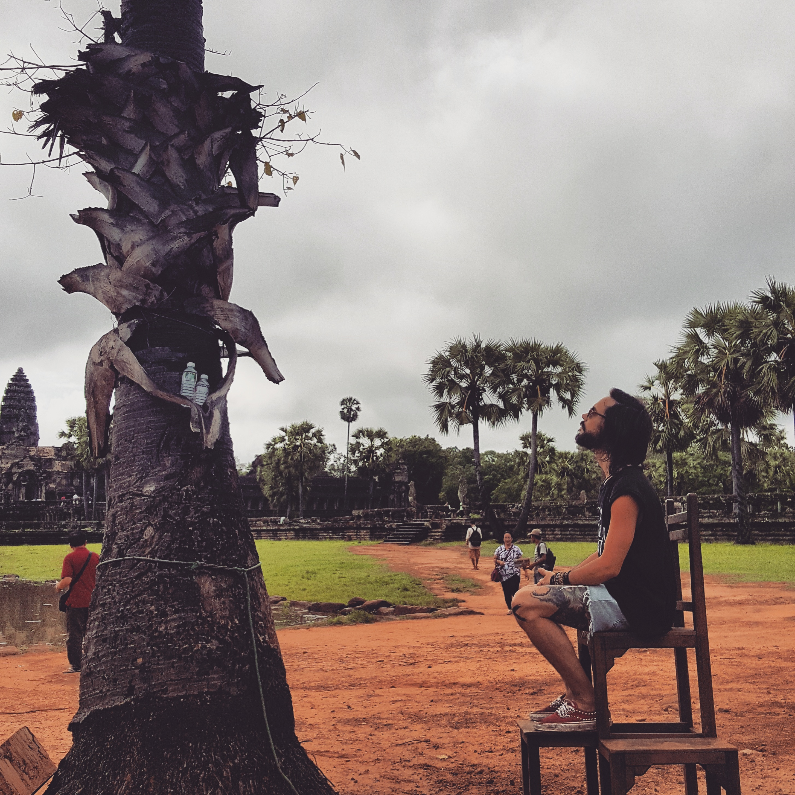

```{r, out.width = "700px", echo = FALSE, eval = TRUE, fig.align='center'}

```


# Resume / CV

You can download my full CV with the following links:

- <a target="_blank" href="DominiqueMakowski_CV.pdf#" class="download" title="English">English</a>

- <a target="_blank" href="DominiqueMakowski_CV_fr.pdf#" class="download" title="French">French</a>


