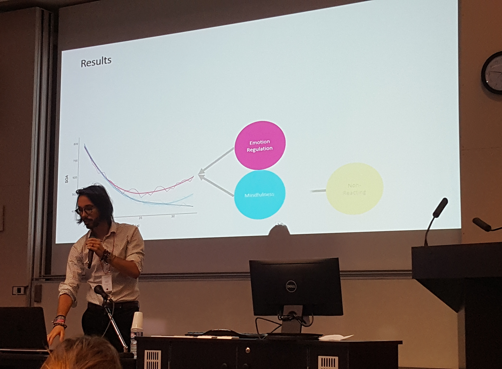

<!-- <style> -->
<!-- .image{float: left;} -->
<!-- </style> -->

<!-- <div style="float:right"> -->
<!--  -->
<!-- </div> -->


I'm a neuropsychologist, psychotherapist & pizza addict, currently living in Paris, France. I'm fluent in French, Polish, English, Python, and somehow good in pretending to speak Italian. My main figures of reference are Churchill, Epictetus and Batman. My interests are as broad as open-science, history of arts and transhumanism. Finally, I encourage you to *illegally* download my papers from the [research](https://dominiquemakowski.github.io/research.html) page `r emo::ji("raised_hands")`

---------

### Download

You can download my **full CV** with the following links:

- `r emo::ji("guardsman")` <a target="_blank" href="DominiqueMakowski_CV.pdf#" class="download" title="English">English</a>

- `r emo::ji("croissant")` <a target="_blank" href="DominiqueMakowski_CV_fr.pdf#" class="download" title="French">French</a>

---------

```{r, out.width = "600px", echo = FALSE, eval = TRUE, fig.align='center', fig.cap="**Me showing some ground-breaking results.**"}

```

---------


### In Short

<p align="center">*Titles and Licenses*</p>


- Clinical Neuropsychologist (2014, University of Sorbonne Paris Cité)
- Cognitive and Behavioural Psychotherapist (2017, AFTCC)

<p align="center">*Certifications*</p>


- Academic Teaching (2017, University of Sorbonne Paris Cité)
- Mindfulness based on Compassion and Insight (2016, Sainte-Anne Hospital)
- First Aid (2016, University of Sorbonne Paris Cité)


