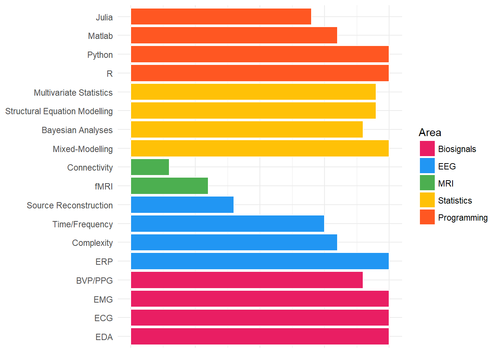

--------------------

<!--  -->

<!-- 
 -->
<!--  -->
<!-- 
 -->

**Showing some ground-breaking results.**

---------

I'm a neuropsychologist, psychotherapist & PhD student, currently living in Paris, France. I'm fluent in French, Polish, English, Python, and somehow good at pretending to speak Italian. My main figures of reference are Epictetus, Churchill and Batman. My interests are as broad as open-science, history of arts and transhumanism. My papers are available on the [research](https://dominiquemakowski.github.io/research.html) page 🙌

---------

### **Download**

You can download my **full CV** with the following links:

- <a target="_blank" href="DominiqueMakowski_CV.pdf#" class="download" title="English">English</a>

- <a target="_blank" href="DominiqueMakowski_CV_fr.pdf#" class="download" title="French">French</a>

---------

### **In Short**

<!-- 
*Titles and Licenses*
 -->
#### Titles and Licenses

- Clinical Neuropsychologist (2014, University of Sorbonne Paris Cité, France)
- Cognitive and Behavioural Psychotherapist (2017, AFTCC, France)

<!-- 
*Certifications*
 -->

<!-- 
*Trainings*
 -->
#### Trainings

- Teaching
    - Academic Teaching (2017, University of Sorbonne Paris Cité, France)
- Clinical
    - Mindfulness based on Compassion and Insight (2016, Sainte-Anne Hospital, France)
    - First Aid (2016, University of Sorbonne Paris Cité, France)
- Neuroimagering
    - Multiscale Neurodynamics of Emotions and their Pathologies: from Oscillations to Complex Networks (2017, University of Lille, France)
    - Introduction to Eye Tracking (2016, University of Sorbonne Paris Cité, France)
    - Signal Processing Theory and Application for EEG (2016, ESPCI, France)
    - fMRI and Connectivity (2015, INSTN, France)
    - fMRI : Preprocessing and Analysis (2015, Sainte-Anne Hospital, France)
- Statistics
    - Statistics and R for the Life Sciences (2015, Harvard University EDx)
    - Machine Learning and Brain-to-Computer Interfaces (2014, ESPCI, France)
    - Introduction to Statistics with R (2014, Paris Sud University, France)
- Programming
    - P4N 2016: Python for Neuroscience (and Psychology) (2016, University of Nottingham, UK)
    - Scientific Programming with Python and Software Engineering Best Practices (2016, Telecom ParisTech, France)
    
#### Technical Skills

