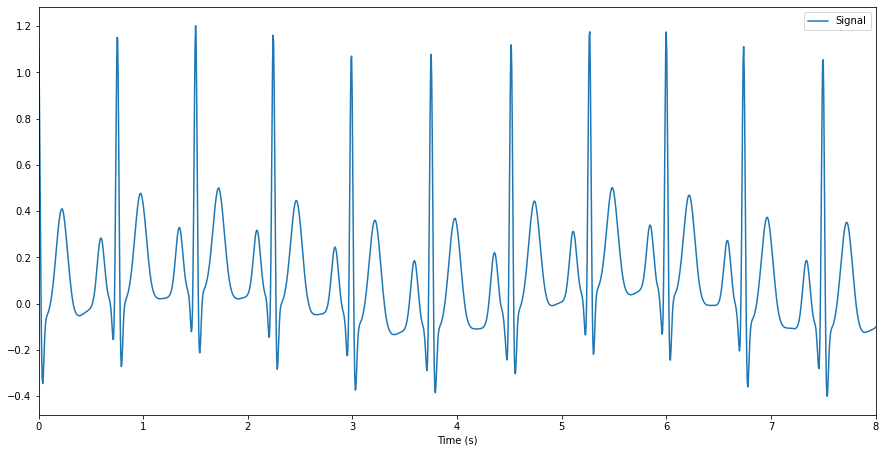
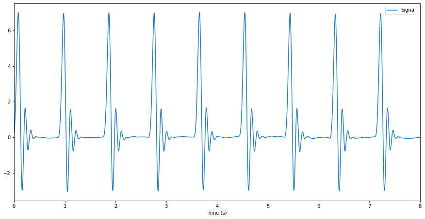

---
authors:
- Dominique Makowski
categories:
- Python
- NeuroKit
- Biosignals
date: "2019-05-17T00:00:00Z"
draft: false
featured: false
image:
  caption: 'Image credit: [**ecgwaves.com**](ecgwaves.com)'
  placement: 0
title: 'Generate an articial ECG signal in Python'
subtitle: 'Simulate a synthetic but realistic ECG signal in Python using NeuroKit.'
summary: Simulate a synthetic but realistic ECG signal in Python using NeuroKit.
tags:
- Python
- NeuroKit
- ECG
- EKG
- Simulate
- Artificial
- Physiological
- Biosignals
---

# Create a natural ECG signal

Generating artificial physiological signals can be very useful to build, test your analysis pipeline or develop and validate a new algorithm.

Generating a synthetic, yet realistic, ECG signal in Python can be easily achieved with the `ecg_simulate()` function available in the [**NeuroKit2**](https://github.com/neuropsychology/NeuroKit#quick-example) package.


In the example below, we will generate **8** seconds of ECG, sampled at **200 Hz** (i.e., 200 points per second) - hence the length of the signal will be `8 * 200 = 1600` data points. We can also specify the average heart rate, although note that there will be some natural variability (which is a good thing, because it makes it realistic).


```python
import neurokit2 as nk  # Load the package

simulated_ecg = nk.ecg_simulate(duration=8, sampling_rate=200, heart_rate=80)

nk.signal_plot(simulated_ecg, sampling_rate=200)  # Visualize the signal
```


The simulation is based on the **ECGSYN** algorithm (McSharry et al., 2003).


However, for fast and stable results (as the realistic algorithm naturally generates some variability), one can approximate the QRS complex by a **Daubechies** wavelet. An ECG based on this method can also be obtained in **NeuroKit** by changing the `method` as follows:


```python
simulated_ecg = nk.ecg_simulate(duration=8, sampling_rate=200, method="daubechies")

nk.signal_plot(simulated_ecg, sampling_rate=200)
```





While faster and stable, the generated ECG is far from being realistic.


👉 [**Discover more about NeuroKit here**](https://github.com/neuropsychology/NeuroKit#quick-example) 👈


Have fun!

# References

McSharry, P. E., Clifford, G. D., Tarassenko, L., & Smith, L. A. (2003). A dynamical model for generating synthetic electrocardiogram signals. IEEE transactions on biomedical engineering, 50(3), 289-294.


---

*Thanks for reading! Do not hesitate to tweet and share this post, and leave a comment below* :hugs:

🐦 *Don't forget to join me on Twitter* [@Dom_Makowski](https://twitter.com/Dom_Makowski)
