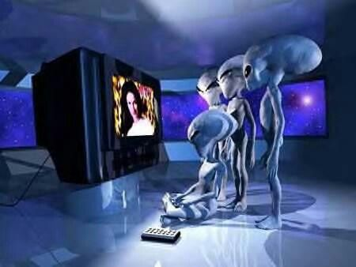
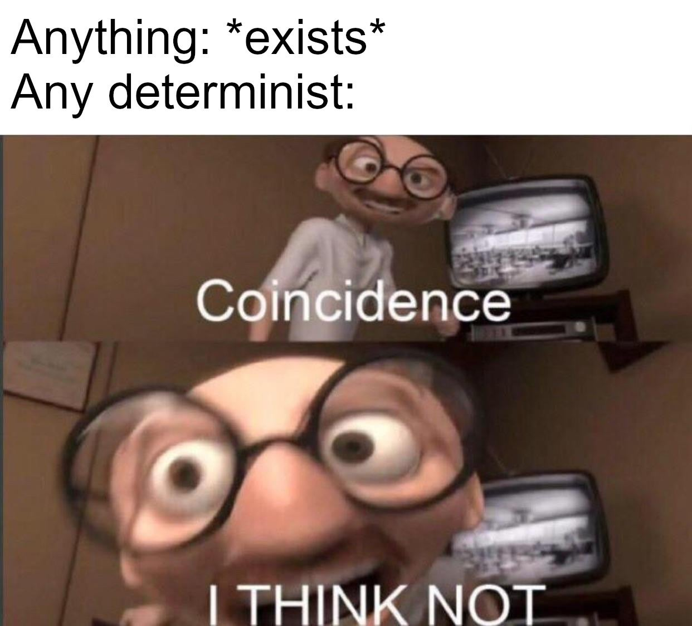

---
authors:
- Dominique Makowski
categories:
- Philosophy
- Science Fiction
date: "2020-11-13T00:00:00Z"
draft: false
featured: false
image:
  caption: '*La Persistence du Temps* with a meow twist (from Fat Cat Art).'
  placement: 0
title: 'Time as a computational limit'
subtitle: ''
summary: ''
tags:
- Reality
- Time
- Determinism
- Transhumanism
- Science fiction
---

*Note: this is a thought-experiment, not to be taken too seriously.*

## We live in a simulated universe

In his famous simulation argument, the transhumanist Bostrom (2003, 2011) posits that **we are living in a computer-generated reality**. The logic behind this assumption is that an advanced civilization, with enormous computing power, might want to create agents with a powerful artificial intelligence, that would be evolving in a simulated world (think of an infinitely more advanced ***The Sims*** Game). These sims (i.e., the virtual intelligences populating the simulation) might be endowed with consciousness, and live their lives in this world, unable to distinguish its simulated nature from the "primary" reality. Moreover, similarly to games that are running on many computers in the world, there could be an important number of these simulated worlds. Moreover, it could reach a point where a simulation could be created inside another simulation. Thus, the number of "sims" would quickly exceed the number of consciousness's living in the primary (i.e., non-computer-generated) reality. Consequently, **it is statistically plausible that we are, indeed, simulated "sims" living in a simulated reality**.

<figure>
  
  <figcaption>Aliens watching episode 2020 of "the Earth" unfold, horrified.</figcaption>
</figure>

It is to note that Bostrom's argument has been criticized, mocked, revised and updated several times. But beyond the flaws in its argumentation and premisses, it is still a fairly appealing thought experiment, and a fascinating possibility. People have been mis-representing this argument, picturing some alien species playing ***The Sims*** with us on mega computers. But albeit Bostrom indeed mostly presents it as a simulation run by other intelligent agents, **this idea could be generalized**. The simulating system could take many forms, not necessarily created by an intelligent design. It just means that there's a "thing" *(a very scientific term, I know)* outside the universe that gives rise to it, one way of another.

**What does it change for our lives?** Pretty much nothing. Indeed, this thrilling hypothesis is somehow irrelevant from a phenomenological and psychological perspective, for the majority of people cannot help but experience a fully deployed [**sense of reality**](https://dominiquemakowski.github.io/post/what_is_realitybending/). They are (normally) endowed with an intuitive feeling and belief that they are real, existing and belonging to a real world. They rarely doubt it, and even if they do so, it is mostly in a philosophical fashion, that does not entail a genuine sensation of uncertainty toward the nature of the world. This sense of reality is fascinating topic on its own (though I'm biased since its my main research topic), independent from the issue of the nature of the universe. Though we could argue that the latter opens up the possibility of tears in the objective reality (either *bugs* of the system or ways of accessing and modifying the fabric of reality), but this ***Matrix***-like aspect of the simulated reality hypothesis is a topic for another time.

So no, the universe being a simulation, aside from being a breath-taking metaphysical consideration, changes practically nothing for our daily lives.

## Determism

Let's put aside this idea of a simulated universe for now and think about determinism. I consider myself, for now, as an **ultra-determinist** (I should rather say, *"the world has made me into a determinist"*). It means that I believe that the universe is unfolding according to some causality laws (many of which are not yet fully known), and that since the origin of the universe (e.g., the Big Bang), things have been evolving according to the only one possible chain of event. Naturally, the hard version of determinism leaves no room for **free will** (though the *illusion* of free will is important) and creates some issues when it comes to responsibility (again, a topic for another time).

<figure>
  
</figure>

Note that this position is not incompatible with a **probabilistic view of the world** (I am also a rather radical Bayesianist :grin:). In this context, the probabilistic perspective is mostly a framework to describe uncertainty and hidden mechanisms. For instance, if I flip a coin, a probabilistic approach would be to consider that there is a 50/50 probability on the outcome. That said, if we manage to gather information on all the parameters (the starting position of the coin, the velocity and angle of the tossing, gravity, the weight distribution on the coin, its resistance to air, characteristics of air pressure, wind etc.), one could pretty much accurately predict what the outcome would be. In other words, the outcome is already "determined" once the coined has been tossed. That doesn't mean that a probabilistic model is not convenient to describe it, especially when we don't have access to all these parameters (or powerful enough models to integrate them).

Many attempts have been made to attack determinism (and especially by people trying to defend the possibility of free will), and recent advances in physics have giving them a lot of ammunition (the most striking example being the - often misunderstood - usage of **quantum uncertainty to explain randomness, free-will, consciousness, god** and pretty much everything). Nonetheless, determinism is one of the simplest assumption that can be made regarding causality and evolution.

## The future is now

Determinism has one important consequence. As all events stem one from the others, in a unique chain of causal events, then if we know the exact state of the system (i.e., you know the state of *all* of the variables of the system) at one point in time, as well as the rules governing the system, we can predict with certainty the system's state at the next point in time, at *t*+1. If we repeat the process, **we know the state of the system at *t*+2, and so on, until the end of times.**

In other words, the end of the universe is engraved in its beginning. The future is already contained in the now. The whole evolution of the universe is already "set". *Myself, writing this post, am an expected consequence of the combination of parameters of the universe's origin.*

## Time as a computational limit of human understanding

The past, and future, are merely but illusions. All the information (about what has been, and what will be) is already known (not known by an intelligent being, but in the sense that the information is existing, encapsulated within each frame of time) **The evolution of the world is, in that regards, similar to that of a movie on a DVD**. All the movie is there, at once. And a computer can read, and "experience" (as far as the phenomenological experience of a computer goes) all that information at once.

Yet we cannot. We have to watch it unfold over time. We are cognitively constrained in that fourth dimension of time. The perception of time passing appears as some limitation of our own cognitive systems: we have to spend one hour and a half in order to make sense of the information. We cannot process it "at once" (we cannot yet just download the movie into our brain, and experience it without watching it). **Is time passing a feature (or limitation) of our understanding?**

Could we imagine (as a thought experiment) some other forms of being that are not constrained nor ever drifting onwards in the time dimension? Which, through their immensely greater cognitive abilities, are able to process a *lot* more information, which renders their prediction and inference of the near past and future very accurate, to a point where they are able to almost "move in time" (at least in short time ranges as the universe)

## Time as a computational limit of the cosmos

One thing to note is that, in the DVD analogy, the watcher is external to the content. We are not talking about Gandalf's experience of its own movie. Which then begs the question, **who's watching our universe?!** (note that this is a logical fallacy used here as a joke; analogy is not homology).

<figure>
  
  <figcaption>The Ancient of Days (William Blake, 1794).</figcaption>
</figure>

But let's go back to that "simulated universe" hypothesis that we started with, to try to integrate with it determinism and its consequence on time. When we play the sims, the sims do not really care about what the speed that we, external Humans, play the game. **Their experience (albeit primitive, but you see my point) is dictated by the system** (the game and the computer). To what extend it can computationally process the information.

It's like when playing **Minecraft** (pardon my video games references). At the start of the game, one must first "generate" the world. This runs a procedural generation algorithm that spatially lays out and populates a world. This can take up to several minutes, depending on how much of a nerd you are (i.e., the specs of your computer). Following this example, if our universe is itself a simulation, could time be a consequence of some limitation of the system that "runs" it (or generates it - after all, maybe God is just waiting for our universe to complete building to be able to play his game of "Worldcraft" or, perhaps more appropriately, "Minehumans"), which might explain the particular nature of the time dimension in our typical environment.

<figure>
  
  <figcaption>"Riddles in the dark..."</figcaption>
</figure>

While these are fun thought experiments to ponder over, note that until there, I have mainly speculated about time as we phenomenologically experience it. I haven't even touched on the possible relationship between the idea of time as a computational limit, and time as it conceived in modern theoretical physics (for instance, as a geometrical dimension of the time-space continuum that can be deformed and, potentially, navigated in). **But for this, you'll need to get me talking after more beers** :beers:

Cheers!

---

*Thanks for reading! Do not hesitate to tweet and share this post, and leave a comment below* :hugs:

🐦 *Don't forget to join me on Twitter* [@Dom_Makowski](https://twitter.com/Dom_Makowski)
