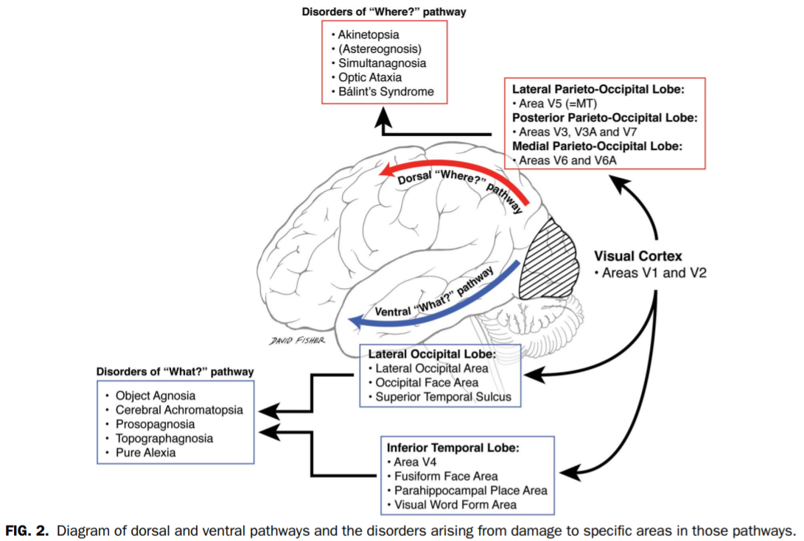

---
authors:
- Dominique Makowski
categories:
- Art
- Neuropsychology
date: "2021-01-03T00:00:00Z"
lastmod: "2021-01-03T00:00:00Z"
draft: false
featured: false
image:
  caption: ''
  placement: 0
title: "What visual agnosia might feel like"
subtitle: "Can you name one thing in this photo? It all looks familiar, but something is off."
summary: "Can you name one thing in this photo? It all looks familiar, but something is off."
tags:
- Art
- Neuroscience
- Neuropsychology
---

### Name One Thing In This Photo

**Can you name *one* thing in the image above?** It all looks familiar, but something is off. The image makes "sense" overall; there are well-defined shapes and objects, that seem to be placed in a plausible - albeit chaotic - fashion, like some random rubbish thrown in the corner of a room. Even the colors, the lightning, the quality, is coherent, and helps making it believable. And yet, chances are you cannot name one single element that composes it.

This image, after appearing on [twitter](https://twitter.com/melip0ne/status/1120503955526750208?s=20) in April 2019, surfaced on reddit with the caption "This picture is **designed to give the viewer the simulated experience of having a stroke** (particularly in the **occipital lobe** of the cerebral cortex, where visual perception occurs.) **Everything looks hauntingly familiar but you just can't quite recognize anything**", and became subsequently [viral](https://www.dailymail.co.uk/news/article-6959547/Extremely-frustrating-slightly-disturbing-image-goes-viral.html). However, the author of the caption later admitted that he made this description up.

*So where does the image come from?*

One can trace back the original publication to an [instagram account](https://youtu.be/0F7XBwFwA-M?t=104), which author declared having made the image using [**ArtBreeder.com**](https://www.artbreeder.com/). This website gives access to an AI algorithm (Generative Adversarial Networks - GAN), commonly used in the processing and generation of images (one mindblowing example can be found on [*thispersondoesnotexist.com*](https://thispersondoesnotexist.com/), which generates realistic pictures of non-existing people). There were even some attempts to *reverse engineer* the process to retrieve what the original image could have been like.

After all, it seems like there is no intelligent design behind this image. No clever neuropsychologist carefully crafting a meaningful experience. Just one of these lucky accident.

Nonetheless, it's still an intriguing image, falling in this uncanny abyss of things that we recognize as familiar, but slightly too alien for our sense-seeking brains to dissolve in meaning. **Could it tell something about brain processes?** Surely, but **brain disorders?** Maybe.

The **"occipital stroke" hypothesis** mentioned above suggests, by its formulation, a lesion to the primary visual cortices. However, as neuroscientists know, these brain regions, located at the extreme back of the brain, are mostly supporting lower level aspects of visual processing, and their damage is usually related to alterations of a somewhat different nature than of that above, such as vision loss, visual hallucinations, visual deformations, loss of color, movement, stereoscopy, etc.

However, there is another neuropsychological disorder, referred to as **"visual agnosia"**, in which patients experience difficulties to recognize visually presented objects, despite preserving an intact vision. In fact, it is more an umbrella term for different subcategories of deficits, and the image above could be reminiscent of visual agnosia of the *associative* type, which corresponds to a a specific impairment in the assignment of meaning to a stimulus that is accurately perceived (and can be visually described). This symptom is often related to injuries in the left occipito-temporal region, located on the ventral "what" stream of the brain (as opposed to the so-called "where" dorsal stream).

### Ivan Seal's Art

From there, the youtuber [*Solar Sands*](https://www.youtube.com/channel/UCR6LasBpceuYUhuLToKBzvQ) helped me discover the artist [**Ivan Seal**](https://en.wikipedia.org/wiki/Ivan_Seal), which work is somewhat akin to the image above. They are not purely abstract renditions, or depictions of impossible entities, but plausible objects that sit in this awkward space, deep between boring reality and total weirdness.

---

*Thanks for reading! Do not hesitate to tweet and share this post and don't forget to join me on Twitter* 🐦 [@Dom_Makowski](https://twitter.com/Dom_Makowski)

