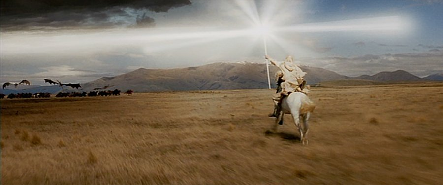
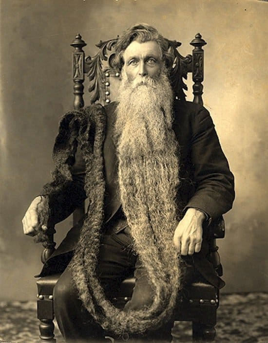
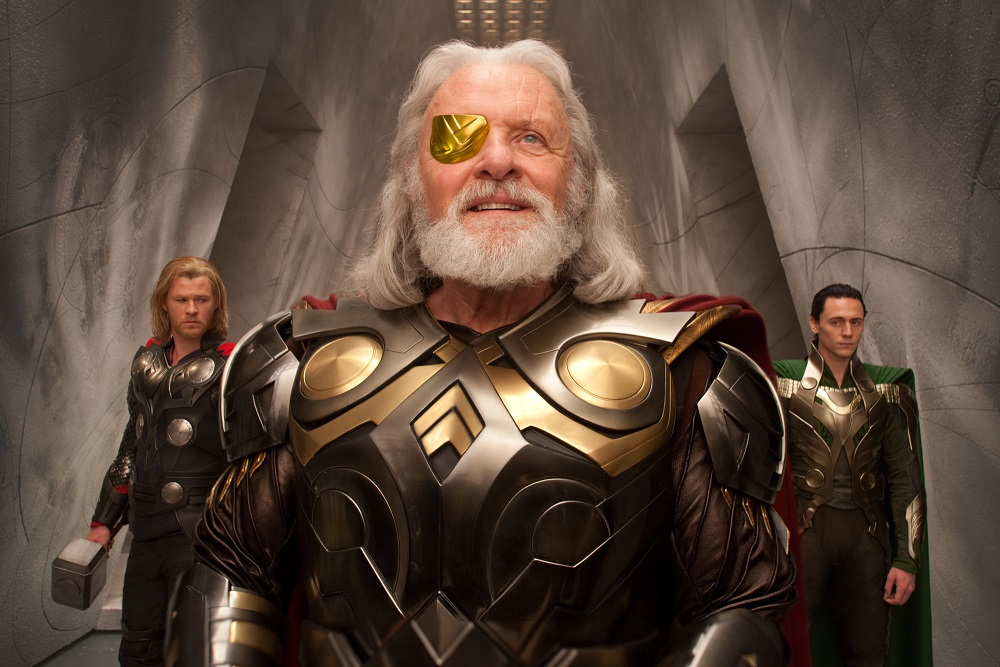
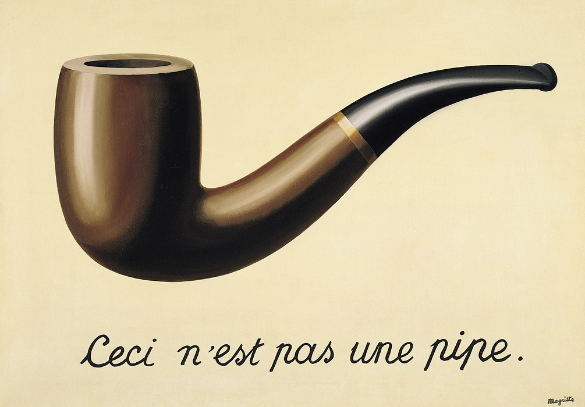
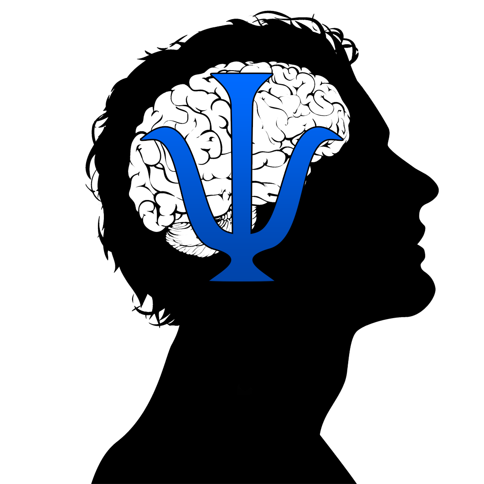
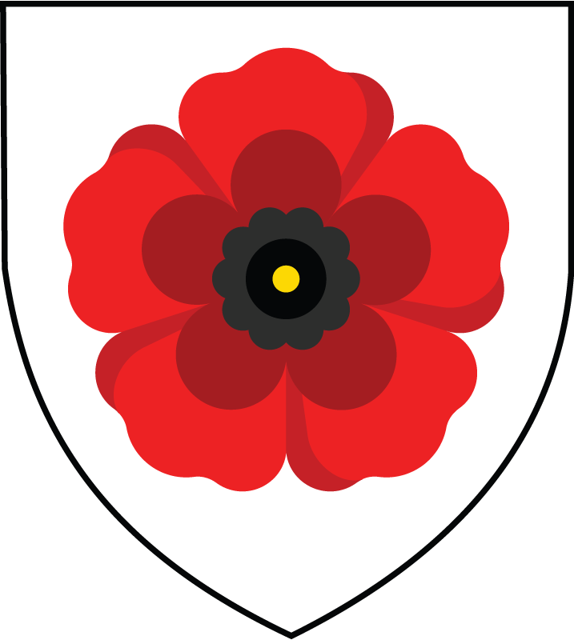

---
authors:
- Dominique Makowski
categories:
- Art
- Reality Bending
date: "2021-06-30T00:00:00Z"
lastmod: "2021-06-30T00:00:00Z"
draft: false
featured: false
image:
  caption: ''
  placement: 0
title: "The symbolism behind the ReBeL logo"
subtitle: "Can you guess all the hidden symbols and elements present in our logo?"
summary: "Can you guess all the hidden symbols and elements present in our logo?"
tags:
- Art
- Neuroscience
- Reality Bending
---

The Reality Bending logo includes several references to various concepts. **Can you try to guess them?**

:point_down: :point_down: :point_down: :point_down: :point_down: :point_down: :point_down: :point_down:

<figure align="center">
    
</figure>

<!-- **.**

    

**.**

    

**.**

     -->

### Wizard

One of the most striking feature of the logo is the guy in the middle, which represents a wizard. It represent us, the people who delve in the science of [reality bending](https://realitybending.github.io/post/2020-09-28-what_is_realitybending/).

Wizards are a powerful [archetype](https://susannabarlow.com/2021/03/26/understanding-the-magician-archetype/), that are primarily defined through the learned ability (by seeking, studying and gathering arcane knowledge) of controlling and manipulating reality. Though many specializations and facets exist, the understanding of the true nature of the world is a core facets that binds all wizards.

<figure align="center">
    
    <figcaption>the wizard Gandalf facing the forces of darkness with his light.</figcaption>
</figure>

<!-- ### Hat -->
<!-- Harry potter? -->

### Beard

In Greco-Roman antiquity, the beard was seen as the defining feature of a philosopher (see the [Philosopher's beard](https://en.wikipedia.org/wiki/Beard#The_%22Philosopher's_beard%22) on wikipedia), expressing the idea that philosophy is no mere intellectual hobby but rather a way of life that, by definition, transforms every aspect of one's behavior (including one's shaving habits).

Show me your beard and I'll tell you what philosopher you are:
- Cynics had long dirty beards to indicate their *"strict indifference to all external goods and social customs"*
- Stoics were occasionally trimming and washing their beards in accordance with their view *"that it is acceptable to prefer certain external goods so long as they are never valued above virtue"*
- Peripatetics took great care of their beards believing in accordance with Aristotle that *"external goods and social status were necessary for the good life together with virtue"*

<figure align="center">
    
    <figcaption>A glorious beard.</figcaption>
</figure>

### Eyepatch

For any mythology fan, a bearded figure with an eyepatch (or a missing eye) is known to represent [**Odin**](https://en.wikipedia.org/wiki/Odin), the chief deity of the norse pantheon. He's a very complex character, with a deeply ambivalent nature. One of the key moment of Odin's story is when he sacrifices one of his eyes in return for wisdom...

Losing *direct sight* of reality in return for a **deeper knowledge** of reality - here is an interesting idea that we can discuss and (over)interpret with some drinks :beer:

<figure align="center">
    
    <figcaption>Odin portrayed by one of my favourite actor.</figcaption>
</figure>

### Pipe

The pipe refers to the most famous painting of the surrealist René Magritte. One of the common interpretation suggests that it symbolizes the difference between the authentic thing (a real pipe) and its representation. This, we believe, is just one level that differentiates the real from the unreal...

<figure align="center">
    
    <figcaption>The Treachery of Images (Magritte, 1929).</figcaption>
</figure>

### Smoke

The smoke takes the form of a Psi letter Ψ, which is the symbol of **psychology**.

<figure align="center">
    
    <figcaption>The Psi within the brain, a representation of neuropsychology, and the logo of the <a href="[url](https://github.com/neuropsychology/Neuropsydia.py)">Neuropsydia</a> software.</figcaption>
</figure>

### The Flower

<!-- ### The Flower  -->

The flower in the background is not just any flower. It is a [poppy flower](https://en.wikipedia.org/wiki/Poppy), from which the seed have been used throughout history to create diverse substances to alter our perception of reality...

Incidentally, it is also the symbol of the *Makowski* family (which names refers to "poppy seed" in polish).

<figure align="center">
    
    <figcaption>The Makowski's Poppy Flower.</figcaption>
</figure>

Did you spot any more :smirk:? Let us know!