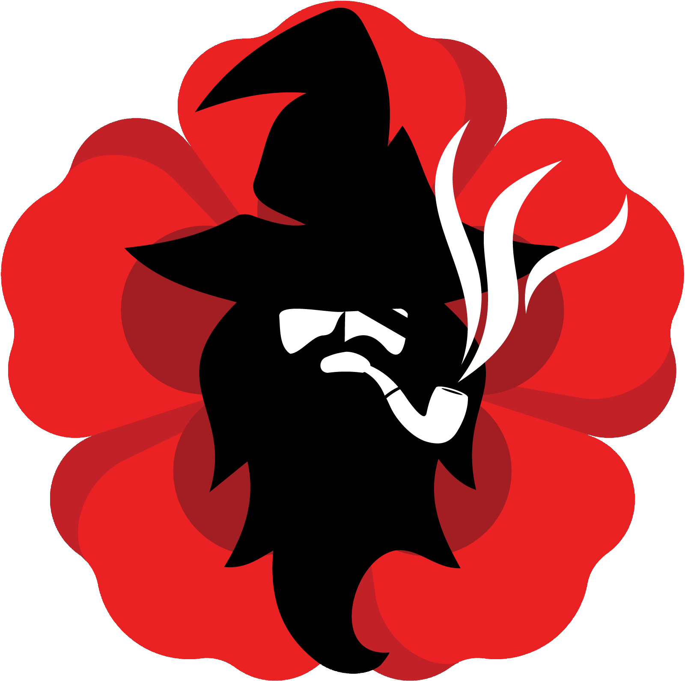
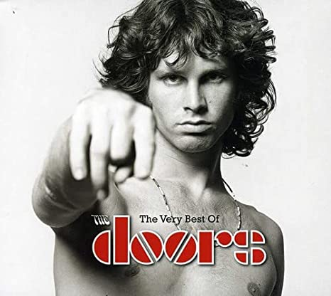

---
authors:
- Dominique Makowski
categories:
- Reality Bending Lab
date: "2023-02-01"
draft: false
featured: false
image:
  caption: ''
  placement: 0
title: "New location and new logo!"
subtitle: "The Reality Bending Lab is moving to the UK, and we're revealing the new logo to celebrate its official start!"
summary: "The Reality Bending Lab is moving to the UK, and we're revealing the new logo to celebrate its official start!"
tags:
- Reality Bending Lab
- ReBeL
- Logo
- University of Sussex
- Brighton, UK
- Psychology
- Neuropsychology
- Matrix
---

New year, new start. And as I am officially starting a new faculty position at the **University of Sussex** in Brighton, UK, the lab is moving too.

To give a bit of perspective, we started as the "Reality Bending League", which was the unofficial name of the team working with me ("League" was chosen to keep the lab's acronym, **ReBeL**). It then became a semi-official group in 2021, when I became a semi-independent PI after being awarded a transition grant from [NTU](https://www.ntu.edu.sg/). And with 2023 comes our fully official start.

<figure>
  
  <figcaption>ReBeL logo (2020-2022).</figcaption>
</figure>

To mark this (re)birth anniversary, we are changing our logo. As much as I loved the old one - which was [**packed with symbols**](https://realitybending.github.io/post/2021-06-30-logo_meaning/), it was arguably a bit too... ***extravagant***. Something more sleek and minimal felt good with respect to the lab's newly acquired legitimacy. I know that many will prefer the old-... sorry, the ***vintage***- logo, and I must say it wasn't easy for me to move forward with the change. Perhaps it will make a come-back in the future in another form, who knows!

The new logo contains 3 symbols. The **curved spoon** is a reference to the Matrix scene where a kid shows Neo how to bend a spoon, which is a **metaphor for reality** (hence of the name of the lab, reality bending).

<figure>
  
</figure>

In the movie, Neo becomes able to **control reality by becoming aware of its illusory nature**, and of the predominant role of one's Self in its generation.

<figure>
  
  <figcaption>"Try to realize the truth... There is no spoon. Then you'll see that it is not the spoon that bends, it is only yourself."</figcaption>
</figure>

The **second meaning** of the logo is the *Psi* Greek letter, symbol of psychology, formed by the spoon and the white vertical line.

<figure>
  
  <figcaption>The logo of the APA features the Psi letter.</figcaption>
</figure>

Thirdly, the black rectangles represent **open doors**, which is a good illustration of progress, research, discovery and... consciousness expansion? Interestingly, Jim Morrison named its band "The Doors" in reference to a quote by William Blake, who said that when ***"the doors of perception were cleansed then everything would appear to man as it is, Infinite"***.

<figure>
  
</figure>

To share a blooper, here is an alternative direction for the logo that wasn't selected, that incorporated the spoon and the open door in another way. Unfortunately, some said it looked too much like the Pixar lamp, or like a spermatozoid...

<figure>
  
  <figcaption>A tentative version of the logo.</figcaption>
</figure>
