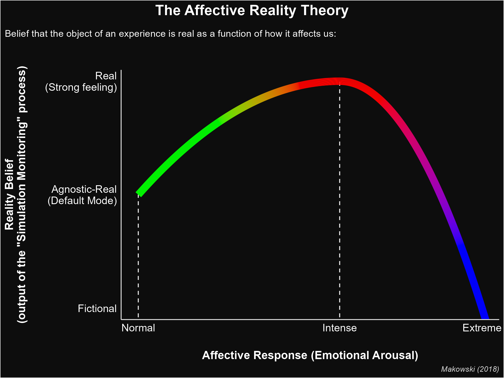

---
authors:
- Dominique Makowski
categories:
- Reality
date: "2023-04-11"
draft: false
featured: false
image:
  caption: 'Morpheus offers an easy way of knowing what is truly real. What is our equivalent for the red pill?'
  placement: 0
title: "How do we know what is real? The 'Affective Reality Theory'"
subtitle: ""
summary: "The Affective Reality Theory posits that affective reactions are key to the formation of reality beliefs."
tags:
- Reality Bending Lab
- ReBeL
- University of Sussex
- Psychology
- Neuropsychology
- Reality
- Embodied Reality Theory
- Affective Reality Theory
- Emotions
- Interoception
- Makowski's PhD
- Makowski's thesis
- Sense of Reality
- Fake news
- ChatGPT
- Simulation Monitoring
- Fictional reappraisal
---

I thought it would be interesting to summarize an idea developed during my PhD on "fictional reappraisal", i.e., on the effect of the belief that an emotional stimulus is not real ([Makowski, 2018](https://www.theses.fr/2018USPCB188)). That of **Affective Reality**, which is a hypothesis about the **role of affective reactions in the formation of reality beliefs**.

The premise it lies on is that we have entered a "post-truth era", in which **the distinction between real and simulated ("fake") objects has become virtually impossible** based on physical characteristics alone. In other words, technology has developed so much that we can forge (or will be able to in the near future) "artificial" **[^1]** content (e.g., text and images with AIs, and even environments with VR) that is indistinguishable from its original counterpart. For instance, face generation algorithms are so advanced that is impossible to tell the difference between a real photo and AI-generated image with a naked eye.

Once we agree on this premise of objective equivalence between reality and simulation, the question of **how do we form judgments and make decisions about the reality of objects** arises. In the absence of clues within the stimuli, we are left with with other sources of epistemological information, such as contextual cues (in the case of news, who is the author, what is the outlet it got published, etc.), and ***internal* cues** (subjective characteristics: how does it relate to our knowledge, how does it make us feel, etc.). The latter is of particular interest to us psychologists.

We refer to the process of forming reality beliefs as **simulation monitoring** ([Makowski et al., 2019](https://realitybending.github.io/publication/makowski2019phenomenal/makowski2019phenomenal.pdf)), which is a somewhat controversial term (that some **[^2]** have considered as almost counterintuitive). The reason for this term, instead of something along the lines "reality appraisal" **[^3]**, is the assumption that **reality is our default mode of experience**. In other words, we are not well equipped (neurocognitively speaking) to detect and classify things as non-real, as these objects are very recent in our evolutionary history. Thus, according to the **Affective Reality Theory**, by default, the brain considers the origin of its experiences as real... but this "belief" is, most of the time, not even fully formed, remaining implicit and subconscious (i.e., we don't spend all our cognitive resources with a constant "this is real. This is real too. That too." labelling). **This default mode acts as a higher-level, transparent prior over our experiences**, providing a scaffolding and structuring our perception, thoughts and reactions. We do not actively appraise the world as real (it is the baseline position), but instead can ask ourselves whether it is simulated, hence simulation monitoring.

<figure>
  
  <figcaption><i>The Affective Reality Theory posits that reality beliefs (the tendency to believe that something is real, as opposed to non-real) is related to  emotions and/or bodily reactions through a quadratic (inverse U-shaped) relationship..</i></figcaption>
</figure>

The **Affective Reality** hypothesis posits that simulation monitoring is strongly connected to "affective processing" **[^4]** through a quadratic (inverse U-shaped) relationship. This means that stimuli associated with a stronger emotional and/or bodily reaction will preferentially bias our judgment towards "reality". In other words, things that elicit feelings and/or bodily arousal, *ceteris paribus*, will be more likely to be classified as "real" (as opposed to fake). In fact, strongly emotional events will even "feel" more real: this transparent default prior and subconscious belief ("agnostic-real") will be replaced in high-intensity scenarios by an explicit and conscious impression that the stimulus is very real, and, if logic opposes, that it "must be real" regardless.

**Isn't it the other way round**, you might wonder: that real stimuli (as opposed to ones believed to be non-real) are associated with a stronger emotional reactions? And that **it is the believed reality that drives the emotional response**? Indeed, we do believe that there is a two-ways relationship between simulation monitoring and emotions. But it is not exactly that beliefs of reality are associated with stronger emotions, but rather that beliefs that something is *not* real leads to a lower emotional response (the usage of fiction as an emotion regulation strategy - "fictional reappraisal" - was the main topic of my doctoral dissertation). In fact, the Affective Reality theory posits that this regulatory effect of **simulation monitoring starts to dominate after a certain point where the emotion becomes too strong** and unbearable: beliefs such as "it can't be real", and other forms of reality denials are invoked automatically to protect us and help us cope with distressing information.

To summarize this summary, the Affective Reality hypothesis claims that from mild to relatively strong emotional stimuli, the effect of affect on simulation monitoring dominates (**+affect -> +reality**) and will bias our judgment towards "reality" (strengthening awareness and confidence), up until a point where the emotion regulation benefits of unreality will be automatically invoked (**-reality -> -affect**), increasing the likelihood and confidence of judgments of simulation (potentially far into psychopathological terrains).

## Open questions

The Affective Reality theory is for now a working hypothesis that we are trying to empirically prove or disprove at the [**Reality Bending Lab**](https://realitybending.github.io/). Moreover, some questions remain open:

- Is it actually **embodied reality or emotional reality?**. While we used the term "affective" reality to remain general, the question of whether it is emotions as a subjective psychological reaction, or merely bodily arousal (reactions of the body, e.g., stronger heart rate variability), that is the key ingredient remains unclear. The role of **interoception** (the ability and tendency to detect, track, attend to and rely on internal signals), while likely important, also remains to be specified.
- Is it the affective **context or stimulus** that matters? Let's assume we have affective reaction concomitant to the experience of an object, but not directly related to the object. Would that bias simulation monitoring? Does perceived causality between a bodily reaction and the object of experience matters?

<!-- Experiment  with loud unpleasant noises around images vs. pleasant noises. -->

<!-- We know that fake news tend to be emotional on average, and are also believed by anxious people. -->

## Notes

[^1]: You may notice that I used different words related to the concept of "unreal", such as simulated, fake, artificial, virtual, fictional. While they can be used interchangeably in the context above, they are not exact synonyms.
[^2]: Like that pesky *reviewer 2*, obviously.
[^3]: Note that "reality monitoring" already exists  as a concept and refers to a (possibly related) mechanism involved in tracking the origin of an experience (e.g., a memory) as internal vs. external.
[^4]: "Affective" is in this context used as a generic term to encompass emotions, feelings and bodily activity (the question of which exactly of these aspects is the key remains to be answered).
