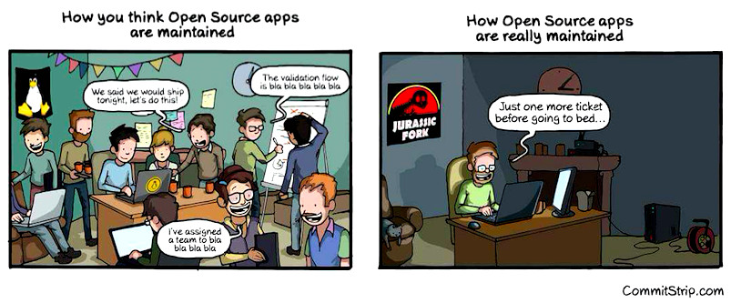

---
authors:
- Dominique Makowski
categories:
- Psychology
date: "2020-05-27T00:00:00Z"
draft: false
featured: false
image:
  caption: ''
  placement: 0
title: 'Why psychologists should join GitHub'
subtitle: 'Top reasons why engaging into GitHub will give you the edge and benefit psychological science.'
summary: 'Top reasons why engaging into GitHub will give you the edge and benefit psychological science.'
tags:
- Github
- Psychology
- Programming
- Psychologist
- Open science
---

{}
**Disclaimer:** I don't have anything to do with GitHub, aside from being a simple user. This article is not an advertisement for it, but rather a perspective on the role of technical social networks in psychology.
{}

I already mentioned in [another post](https://dominiquemakowski.github.io/post/r_or_python/) that **technical aspects and skills will play an increasing role in psychology**. This relationship isn't by any means new. More than a century ago, pioneering psychologists were demonstrating formidable engineering and craftsmanship skills to build new tools and apparatuses to measure what they were interested in (see for instance [Nicolas & Makowski, 2016](https://dominiquemakowski.github.io/publication/nicolas2016can/)). But years have gone by, and the digital revolution has happened. As a result, most of the "technical" aspects (a rather vague term covering everything that is not related to the semantic knowledge of psychological theories and facts) are now ultimately tied to *software*. Critically, **your ability to use these softwares will determine the speed and ease at which you can achieve your goals and produce high quality assignments**.

As an example, during my studies, most of the statistics course was delivered through the usage of one particular software (Statistica© 🤮). At the exam, your score didn't much depend on your understanding of what a *t*-test is, when to use it or anything like that; but rather on your knowledge of the software, and your ability to **click on the right buttons faster than your peers**. While this is an unfortunate example that can be used to criticize the reliance on tools rather than fundamental knowledge, it also tells us something about the reality of the current world. In research, the better you are for instance at data processing (which involves both the knowledge of how to navigate the software *and* the knowledge of what to do in general), the faster you will be able to carry it out, and the less stressed you will be, resulting in a cascade of other positive outcomes (increased well-being, work-quality, productivity, opportunities, etc.).

However, **one common mistake is to delay learning** new stuff (especially things outside our comfort zone) until we have no choice. This is understandable given that in the short term, certain skills may not be absolutely needed (i.e., you can manage without them) and acquiring them can be a steep learning curve (which can be hard, frustrating and effortful). However, you should start investing in your technical skills as soon as possible (as the time devoted to learning will only shrink as you advance) if you don't want to become very **close friends with pressure, stress, hatred, frustration and despair**. So stay on the light side of the force and embrace the future.

<figure>
  
  <figcaption>A psychology researcher realizing that he should have learned programming earlier.</figcaption>
</figure>

And it's not just about learning to **use** some software just for the sake of having things done and getting faster results. A lot of science is done *through* software, not only *with* them. People are actively discussing new methods, algorithms and tools that then expand like never before the possibilities of researchers. **Flaming debates have been going on with frameworks and workflows clashing with thunderous sparks** (for instance, Bayesian *vs.* frequentist statistics, ANOVAs *vs.* (mixed) regressions, etc.), and these calls for change find echo because of developments of software, allowing initiated users to test, validate and use new methods.

## Open-access software

It might not seem like it when you're studying it at the university, but science is currently in the middle of a **revolution**. A massive paradigmatic change, partly fuelled by the growth of **open-science**, which covers aspects like open-access and open-source. This means, for software, that they are no longer being developed by private companies and sold for money. Instead, they are developed in a public fashion, and **everybody is welcome to chime in and provide input, suggestions, report bugs or improve the code**.

Open-source development means faster and better software, and more importantly, the creation of a **true connection between developers and users**. In fact, the former are often first and foremost also the latter, meaning that in a lot of cases (at least, mine 😅), people started writing a software because they needed it for their own personal job.

But the beauty lies in the fact that **users can seemingly become developers** too, or **contributors**, at the very least. Sometimes, users end up on a software development page to solve a bug or an issue that they encountered. From there, there can start following the developments, and getting involved. And **not necessarily be writing code**. It can be by answering to other issues, helping other users, reporting bugs and typos, improving the documentation, giving ideas and suggestions, testing new features and encouraging the developers. There are so many to contribute to the development and, as a result, become an active member of the open-science community. And moreover, doing so is also a great way to learn the theoretical bits. For instance, the most efficient way of learning the complexities of EEG acquisition and processing was to follow the development of an EEG-processing software (namely, [*MNE-Python*](https://mne.tools/stable/index.html)). Reading issues that users encountered, and replies from experts and developers, trying to understand what functions do, what are the different parameters, what are the possibilities, the limits and so on.

All in all, engaging in open-source software is a great way to increase your technical expertise and get involved in the community of researchers. And who knows, you might meet cool people, create new connections, and that's always great!

<figure>
  
  <figcaption>Help making the first pane true.</figcaption>
</figure>

## Software as a social network

Now that you've buckled up, ready to engage in open-source software, you might wonder; **where does that happen?** Ladies and gentlemen, let me introduce [**GitHub**](https://github.com/neuropsychology/NeuroKit).

Several years ago, when I was an undergrad student, I had to write a lot of stuff, such as for instance reports, project and theses. All of these documents went through several back and forths with supervisors, which made comments and modifications. But I was terribly afraid to remove some paragraph or sentence that I would need later on. As a result, I ended up in a hell in which my tormentors were named `project.docx`, `project_v2.docx`, `project_v3.docx`, `project_v3_modifs.docx`, `project_v3_final.docx`, `project_v4_comments.docx`, `project_v4_final.docx`, `project_v4final2.docx`, `project_v4_finalfinal.docx`. And what if my computer broke (that was before Dropbox)? I could lose everything 😱

This is when I heard about something called **version control**. Apparently, there was a system out there that allowed you to save **all** your modifications, and be able to go back at *any* point in time. This system was called *git*, and it was super obscure. However, I discovered that this system had a, online interface, in the form of a website, on which you can go and upload files and documents for free. This is how **I discovered GitHub**. And back in the days, it was really mostly used by programmers (because the nature of code makes it very suited for *version control*), a world I didn't belong to.

{}
There several great alternatives go *GitHub*, like *GitLab*, *BitBucket*, etc., that might be just as good, if not better. The reason why I'm mainly talking about *GitHub* here is because this post is not about the intrinsic quality or features of these platforms *for developers*, but rather as a social network. An important part of any social network is its popularity and - as of for now - *GitHub* is the most popular.
{}

I witnessed **GitHub** growing and becoming a true *social network*, improving its accessibility and user-friendliness. It is now more like a hub where all kinds of people gather to discuss software and technical bits, than a den for hairy geeks. There are also many users who are new to programming (e.g. researchers who are using software as a means to an end) and if you belong to this category of people, don't underestimate your contribution to developers! Often it is such users that help developers improve user friendliness and identify code bugs (for example, when running the code on actual data sets). It is also used as a public technical portfolio, in which you can display your achievements, your projects and your interests. And while it was originally centred around programming, it has extended its audience quite a bit, and people are now using GitHub to store data (for instance the COVID-19 data), books, create websites (for instance, this website is stored on GitHub) or write scientific papers!

The reason why I'm writing this is because I know all too many young researchers, grappling with some software, struggling to find help, that are too shy to just contact the developers or the community. Just jump in there, create a public issue (instead of writing an email, so that your question will benefit future users). Most of the developers will be happy to help, and glad to see their software and code actually used by others.

In conclusion, go and dive into the world of open-science and open-source software, you'll be on the right side of history. 😎

## What to do once you're on GitHub

At the very least, the very first step is to create an account. Even if you don't use it now, it will be useful in the future (it shows that you are interested in technical stuff, it allows you to post issues and connect to other platforms, and support developers).

1. **Find** a package / software that you like. Super biased suggestions include:
    - [*NeuroKit*](https://github.com/neuropsychology/NeuroKit): a Python package for Neurophysiological Signal Processing
    - [*bayestestR*](https://github.com/easystats/bayestestR): an R package for Bayesian statistics
    - [*correlation*](https://github.com/easystats/correlation): an R package for correlations
    - [*report*](https://github.com/easystats/report): an R package to report statistics
    - [*effectsize*](https://github.com/easystats/effectsize): an R package for effect sizes
    - [*parameters*](https://github.com/easystats/parameters): an R package for understanding statistical models
    - [*performance*](https://github.com/easystats/performance): an R package for testing how good your model is
2. "**Watch it**" (the button in the top-right corner), so you'll be notified of its activity
3. **Read** the README file (the "front page"), check-out the issues, understand how to navigate the repository
4. **Engage** with the developers, create an issue to report bugs or problems, or just to express support - developing a software takes time and effort, and is often done out of passion and for free. Words of encouragement are always appreciated 🤗
5. **Create** your own [**repository**](https://guides.github.com/activities/hello-world/)
6. **Make** your own [**website**](https://pages.github.com/)

And if you want to learn how to use **GitHub** to make contributions, check-out our [**tutorial**](https://neurokit2.readthedocs.io/en/latest/tutorials/contributing.html)!

---

*Thanks for reading! Let me know if I forgot something by adding a comment below* 👇

