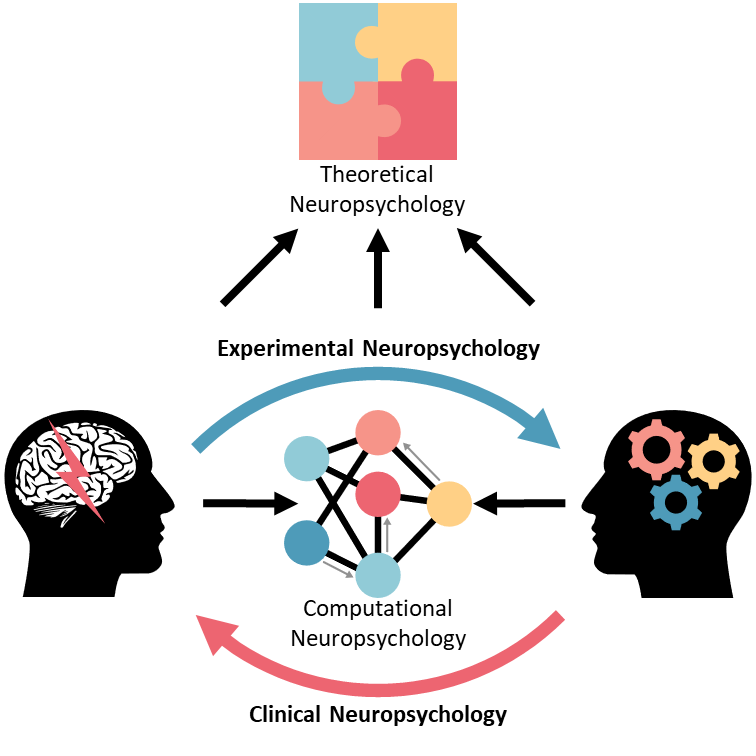

## The place of neuropsychology

**Let's make a simple experiment**. Pick one young and brilliant neuropsychologist and ask "what is neuropsychology?". In some cases, after a few seconds of hesitation, you could hear answers like "being a neuropsychologist means doing *this* or *that*". In other cases, you might come across incomplete - or even false - responses, such as "neuropsychology is a tool", "a method", "a paradigm", or even worse, "a point of view".

That does not mean that our neuropsychologist is incompetent, far from it. But formally defining our field as a whole is not an exercise that we are used to do. Indeed, **the training in neuropsychology usually comes in a fragmented way**, little by little. *A bit of cognitive neuroscience here, a bit of neuropsychological syndromes there, some cognitive tests administration over here, and some cortical neuroanatomy over there...* Though we might, *in fine*, acquire a global vision and understanding of neuropsychology, verbalizing it is seldom necessary.

The definition of neuropsychology is actually quite complex to formalize, and can even be hotly debated. The jobs and positions that stem out of this field are many, and **practitioners often tend to circumscribe neuropsychology to their own activity**. For instance, a neuropsychologist that mainly does cognitive rehabilitation with psychiatric patients might have quite a different vision from another that does, day after day, presurgical cognitive assessments. And that is without mentioning the neuropsychologists pursuing an academic career, or even the ones that have moved to the private sector.

*No problem*, would argue the careful reader, *if the definitions are too narrow, let's take more general one*. **It's not that simple**. Indeed, neuropsychology occupies a very particular place in the network of science, as it is at **the crossroads between social sciences, biological sciences and medical fields**. Giving a definition that is too large would lose its essence in the nebulous depths of neuroscience and psychology, which would be not be accurate; neuropsychologists, whether they are clinical practitioners or not, have a common training, a specific theoretical grounding, as well as a unique interpretation and analysis framework underpinned by a scientifically rigorous method. Taking these elements into account, I will attempt to give a **simple, comprehensive and informative definition of neuropsychology**.

The first axiom that we need to discuss is the notion of science. **Is neuropsychology its "own" scientific field**, or is it a mere portion of another one, such as cognitive neuroscience or psychology, which differs from other specializations only through its object of interest? *"By science"*, says Schopenhauer in his PhD thesis with a baroque title (On the Fourfold Root of the Principle of Sufficient Reason), *"we understand a system of notions, i.e. a totality of connected, as opposed to a mere aggregate of disconnected, notions."* This definition applies well to neuropsychology, that contains a set of theories, hypotheses, methods and proofs feeding from one another and creating a coherent ensemble. As such, neuropsychology is its own scientific discipline, although a singular one...

Indeed, **what is the "bigger" box in which neuropsychology fits?** While neuropsychologists are often initially trained in psychology, one could argue that the focus on the brain makes it more belonging to neuroscience. Well, the organization and structure of Science is a complicated issue. However, the particularity of the topographical location of neuropsychology is quite apparent.

On the one hand, neuropsychology belongs to a cluster of sciences interested a specific biological organ: the brain. As such, **neuropsychology is an integral part of neuroscience**. On the other hand, neuropsychology is interested in the productions of the brain (e.g., thoughts, feelings and behaviours) with a focus on the cognitive level (analyzing things in terms of cognitive processes and mechanisms), which makes it also **belonging to psychology**. Moreover, one could argue that neuropsychology, through its integration of the study of what we are biologically, and who we are mentally, has been connected to, and used as evidence in, **philosophy of mind** debates (for instance, famous neuropsychological cases studied by Sacks, Ramachandran or Milner have been widely discussed by contemporary philosophers). Finally, contrary to many other domains, neuropsychology has also an applied, practical component, that can be used in clinical practice. This clinical aspect, registering **neuropsychology withing medical fields**, takes multiple forms, such as assessment, diagnostic or therapeutic care, and can be used with a wide variety of patients and illnesses. These multiple facets make the wealth of **neuropsychology, which offers an exceptional freedom of practice**.

As we have seen, **neuropsychology is located at the centre of colliding galaxies of knowledge**, such as neuroscience, psychology, medicine and philosophy. However, the fast development of neuropsychology is gradually leading to the creation of subcomponents within itself, corresponding to different practices and theoretical steps. And these clusters are themselves growing. For instance, clinical neuropsychology was historically focused on diagnostic cognitive assessments, but has recently expanded on the treatment-side of things, with innovations like cognitive training and rehabilitation. This underlines neuropsychology as a rapidly evolving field, moving its potential towards yet uncharted territories.

## The fourfold structure of neuropsychology

Neuropsychology is born from the convergence of **cognitive neurology**, with pioneers such as [Broca](https://en.wikipedia.org/wiki/Paul_Broca) and [Wernicke](https://en.wikipedia.org/wiki/Carl_Wernicke) (which made inferences about brain functioning based on the observations of patients with brain lesions) and psychologists such as [Ribot](https://en.wikipedia.org/wiki/Th%C3%A9odule-Armand_Ribot) (focusing on the organization and semiology of cognitive deficits). This history has shaped neuropsychology as a two-faced entity, with one **experimental side** dedicated to understand the relationship between brain and cognition (by using pathological cases or natural variability of neurocognitive characteristics), and one **clinical aspect**, focusing on bringing this knowledge to the benefit of the patients suffering from brain disorders.

However, beyond these two pillars of neuropsychology, recent advances have outlined a more **theoretical level** of neuropsychology, dedicated to a high-level integration of the data at hand to elaborate general theories and interfacing them with evolutionary or philosophical principles. Similarly, a **computational** facet, referring to the operationalization of the functioning in statistical terms, starts to emerge as a pseudo-independent aspect, propelled by the regain of interest and focus on the methodological and statistical aspects of psychology and neuroscience.

This structure is not fixed, but driven by the evolution of the field. It is possible that new poles will emerge, or differentiate over time, until maybe they separate from - or create new clusters within - neuropsychology.

<figure>
  
  <figcaption>The fourfold structure of neuropsychology.</figcaption>
</figure>

## The definition of neuropsychology

**Neuropsychology is a theoretical and practical science investigating the relationship between 1) the structure and functioning of the brain, and 2) cognitive processes and their related derivatives, such as thoughts, feelings and behaviours.** It is organised in four interconnected and overlapping dimensions:

- **Experimental neuropsychology** studies the variability of the brain and cognition (whether from pathological origin or not) to test theories and models through empirical experimentation.
- **Clinical neuropsychology** uses theories and models about mental functioning to better detect and assess disorders and deficits, leading to a precise diagnostic and an adapted treatment.
- **Computational neuropsychology** transforms the data acquired through experiments and observation into logical or statistical models of mental functioning that are used to operationalize the processes at stake.
- **Theoretical neuropsychology** integrates the evidence to elaborate and develop unifying theories to address fundamental questions about mental functioning.

Neuropsychology is located at the crossroads between neuroscience and psychology, at the interface between theory and practice. **Its practitioners, the neuropsychologists**, are bound by a specific training, by unique theoretical and historical references, and are endowed with an analysis and interpretation framework backed by a rigorous and scientific investigation methodology.

<!-- La neuropsychologie expérimentale étudie les variabilités du cerveau et de la cognition (qu’elles soient d’origine pathologique ou non) pour tester des modèles et développer des théories sur le fonctionnement mental, visant ainsi à une meilleure compréhension de l’Homme. -->

<!-- La neuropsychologie clinique utilise les théories et les modèles sur le fonctionnement mental pour mieux détecter et appréhender les troubles et les déficits d’une pathologie, menant à un diagnostic précis, tout en développant et appliquant des prises en charges modernes et adaptées. -->

<!-- La neuropsychologie se situe au centre de la nébuleuse des neurosciences, au carrefour de la théorie et de la pratique. Ses praticiens, les neuropsychologues, sont liés par une formation commune, des bases théoriques spécifiques, un canevas d’analyse et d’interprétation sous-tendu par une méthode d’investigation rigoureuse et scientifique.  -->

*Thanks for reading! Do not hesitate to tweet and share this post, and leave a comment below* :hugs:

## References

- Nicolas, S., \& Murray, D. J. (1999). Théodule Ribot (1839–1916), founder of French psychology: A biographical introduction. History of Psychology, 2(4), 277.
- Schopenhauer, A. (1813). *On the Fourfold Root of the Principle of Sufficient Reason*. PhD dissertation.

You can reference this post as follows:

- Makowski, D. (2020, September 13). What is Neuropsychology?. Retrieved from https://dominiquemakowski.github.io/post/what_is_neuropsychology/

