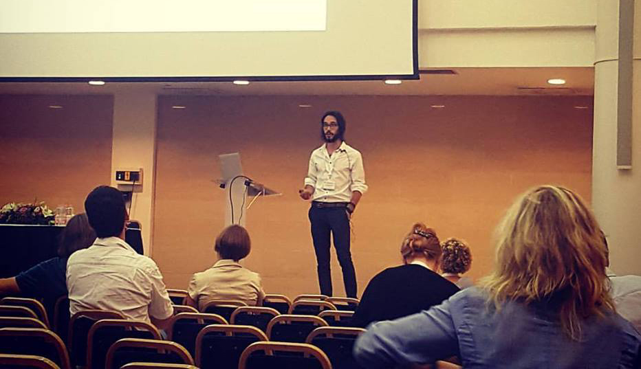

```{r, out.width = "700px", echo = FALSE, eval = TRUE, fig.align='center'}

```


## Neuroimaging

| Link          | Description |
|------------------------------|------------------------------------|
| [Biosignals processing in Python](http://neurokit.readthedocs.io/en/latest/tutorials/Bio.html)| Process biosignals, such as electrodermal (EDA), cardiac (ECG), respiratory (RSP) or muscular (EMG) data with Python and NeuroKit.
| [EEG](http://neurokit.readthedocs.io/en/latest/tutorials/EEG.html) | EEG and MEG processing using Python and NeuroKit (currently under developpment).|

## Statistics

| Link          | Description |
|------------------------------|--------------------------------------|
| [To Do](http://rpubs.com/YaRrr/MLTutorial)| The basics of R for psychology and neuroscience.| 


