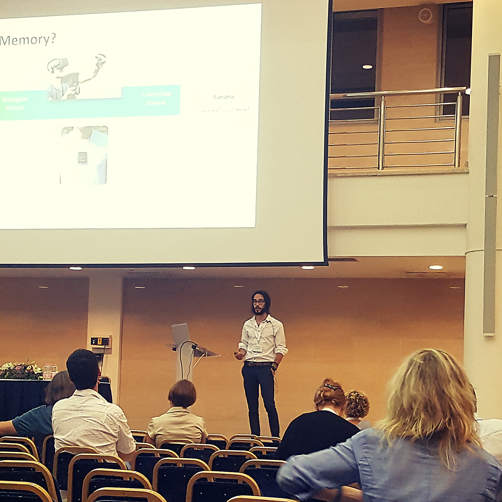

--------------------


```{r, out.width = 650, echo = FALSE, fig.align='center', fig.cap="**Writing a program to solve the hard problem of consciousness.**"}
knitr::include_graphics("media/code.jpg")
# USE rmarkdown::render_site(encoding = "UTF-8") to render the website. Then push with github.
```

--------------------

# Academic


I've already give academic lectures on the following topics (see [CV](https://dominiquemakowski.github.io/about.html) for details):

- **General Neuroscience and Psychology**: Neuroanatomy, emotion regulation, mindfulness, psychological trauma and handicap
- **Clinical Neuropsychology**: Main neurodegenerative, neurological and psychiatric disorders, neuropsychological examination and diagnostic, psychometry, cognitive rehabilitation, practice supervision
- **Cognitive Psychology**: Models of working memory, mental imagery and categorisation
- **Differential Psychology**: Experimental methodology, scientific reasoning, psychometric properties of tests and questionnaires, statistics and introduction to concepts such as intelligence, personality and creativity

--------------------

# Technical


My technical expertise covers the following topics (see [CV](https://dominiquemakowski.github.io/about.html) for details):

- **EEG**: Theory, aquisition (Brain Products and Geodesic) and processing (using [MNE](http://martinos.org/mne/stable/index.html))
- **Biosignals**: ECG, EDA, RSP, BVP and facial EMG theory, acquisition (Biopac) and processing (using [NeuroKit](https://github.com/neuropsychology/NeuroKit.py))
- **MRI**: Beginner (see [CV](https://dominiquemakowski.github.io/about.html) for details about the trainings)
- **Statistics**: Bayesian (or frequentist) mixed modelling, machine Learning, structural equation modelling
- **Programming**: Python, R, matlab, currently learning Julia


<!-- ```{r, out.width = "500px", echo = FALSE, eval = TRUE, fig.align='center'} -->
<!--  -->
<!-- ``` -->
