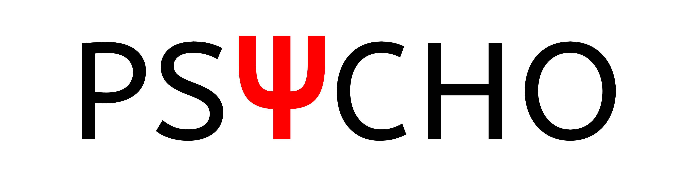

```{r echo=FALSE, fig.align='center', message=FALSE, warning=FALSE, out.width=700}
# library(png)
# library(grid)
# library(gridExtra)
# n <-  rasterGrob(as.raster(readPNG("media/neuropsydia.png")))
# nk <-  rasterGrob(as.raster(readPNG("media/neurokit.png")))
# psy <-  rasterGrob(as.raster(readPNG("media/psycho.png")))
# grid.arrange(n, psy, nk, ncol = 3)
# USE rmarkdown::render_site(encoding = "UTF-8") to render the website. Then push with github.
```


I'm the author of 3 *main* open-source packages, respectively devoted to signal processing, statistics and experiment creation.

----------------


```{r, out.width = 300, echo = FALSE, fig.align='center'}

# USE rmarkdown::render_site(encoding = "UTF-8") to render the website. Then push with github.
```


### **NeuroKit** 
  - A Python Toolbox for Statistics and Neurophysiological Signal Processing (EEG, EDA, ECG, EMG...).
  - [https://github.com/neuropsychology/NeuroKit.py](https://github.com/neuropsychology/NeuroKit.py)
    
----------------

```{r, out.width = 300, echo = FALSE, fig.align='center'}

# USE rmarkdown::render_site(encoding = "UTF-8") to render the website. Then push with github.
```


### **Psycho**
  - An R package for Efficient and Publishing-Oriented Workflow for Psychological Science.
  - [Blog](https://neuropsychology.github.io/psycho.R/)
  - [https://github.com/neuropsychology/psycho.R](https://github.com/neuropsychology/psycho.R)
    
----------------


```{r, out.width = 300, echo = FALSE, fig.align='center'}
knitr::include_graphics("media/neuropsydia.png")
# USE rmarkdown::render_site(encoding = "UTF-8") to render the website. Then push with github.
```


### **Neuropsydia**
  - A Python Module for Creating Experiments, Tasks and Questionnaires.
  - [https://github.com/neuropsychology/Neuropsydia.py](https://github.com/neuropsychology/Neuropsydia.py)
    
----------------