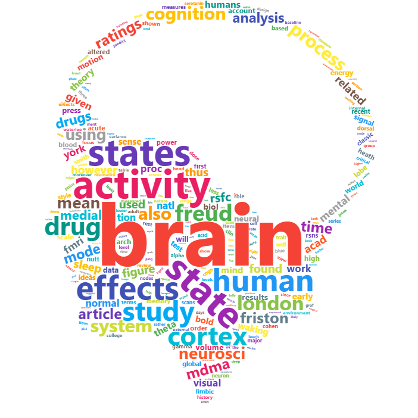

--------------------

<!-- ```{r, out.width = "400px", echo = FALSE, eval = TRUE, fig.align='center'} -->
<!--  -->

<!-- # USE rmarkdown::render_site(encoding = "UTF-8") to render the website. Then push with github. -->
<!-- ``` -->
<!-- --------- -->

<p align="center">
```{r echo = FALSE, echo=FALSE, message=FALSE, warning=FALSE, echo=FALSE, fig.align='center', fig.cap="**My research wordcloud, based on the most frequent words of my papers (done using R).**"}
library(stringr)
library(wordcloud2)
library(pdftools)
library(tidyverse)


replace_and_add <- function(data, target, add_to, delete=T){
  if (!add_to %in% data$word){
    data[nrow(data) + 1,] = c(add_to, 0)
  }
  data <- data %>% 
    mutate(
      newfreq=freq[word==target],
      newfreq=replace(newfreq, !(word %in% c(add_to)), 0),
      freq=as.numeric(freq)+as.numeric(newfreq)) %>% 
    select(-newfreq)

  if (delete==T){
    data <- filter(data, word!=target)
  }
  return(data)
}

# ------------------------------

sources <- list.files(path = "./papers", pattern = "pdf$")


text <- c()
for (source in sources) {
  text <- c(text, pdftools::pdf_text(paste("./papers/", source, sep="")))
}

text <- unlist(text)
text <- paste(text, sep=" ", collapse="") 
text <- iconv(text, "UTF-8", "ASCII", sub="")


text_clean <- tm::termFreq(text, control = list(removePunctuation = TRUE, tolower = TRUE, removeNumbers = TRUE, stopwords = TRUE, wordLengths = c(2, Inf)))

data <- data.frame(word = rownames(as.matrix(text_clean)), freq = rowSums(as.matrix(text_clean))) %>% 
  arrange(desc(freq)) %>% 
  replace_and_add("er", "emotion", delete=F) %>% 
  replace_and_add("er", "regulation") %>% 
  replace_and_add("psychologie", "psychology") %>% 
  replace_and_add("psychologique", "psychological") %>% 
  replace_and_add("mditation", "meditation") %>% 
  replace_and_add("ction", "fiction") %>% 
  replace_and_add("ctional", "fiction") %>% 
  dplyr::mutate(length=stringr::str_length(word)) %>%
  dplyr::filter(freq >  50) %>% 
  dplyr::filter(freq < Inf) %>% 
  dplyr::filter(length >= 4) %>%
  dplyr::select(-length) %>% 
  dplyr::filter(!word %in% c("dans", "plus", "pour", "avec", "cette", "comme", "sont", "tion", "also", "france", "nature", "lhrdit"))


data$word <- stringi::stri_trans_general(data$word, "latin-ascii")
# colours <- rep(c("#f44336", "#E91E63", "#9C27B0", "#673AB7", "#3F51B5", "#2196F3", "#03A9F4", "#00BCD4", "#009688", "#4CAF50", "#8BC34A", "#CDDC39", "#FFEB3B", "#FFC107", "#FF9800", "#FF5722", "#795548", "#9E9E9E", "#607D8B"), length.out = nrow(data))
colours <- c("#f44336", "#E91E63", "#9C27B0", "#673AB7", "#3F51B5", "#2196F3", "#03A9F4", "#00BCD4", "#009688", "#4CAF50", "#8BC34A", "#CDDC39", "#FFEB3B", "#FFC107", "#FF9800", "#FF5722", "#795548", "#9E9E9E", "#607D8B")


# wordcloud2(data, size = 0.25, color=colours, figPath = "media/brain.png")
wordcloud2::wordcloud2(data, size = 0.5, color=colours, shape="circle")
```
</p>

----------------

# Research Topics


In 1896, the Lumière brothers presented a 50-seconds long movie of a train's arrival at a station. Intense fear and awe rose up among the audience, as if they could not believe that it was not a real train. Several decades later, the edges of our reality still continue to fade. Through virtual reality, augmented reality and new forms of fictions, simulations of all kind populate our everyday experience and challenge our intuitive *feeling* and *belief* concerning its reality. Understanding the neurocognitive processes underlying this sense of reality is what drives my research. This topic is heavily connected with others levels and states of the Self such as minimal consciousness, mindfulness, attentional absorption, presence or dreams and has an obvious echo in several neuropsychiatric diseases such as schizophrenia, PTSD or depersonalisation-derealization disorder. As it also shares a strong relationship with emotional processing, modifications of the sense of reality might be at stake in some forms of voluntary or involuntary emotion regulation mechanisms (such as distancing, decoupling, defusion, decentering or fictional reappraisal).


More generally, my scientific interests also include the following topics: 

- **Emotion Regulation.** The unicity and diversity of emotion regulation strategies, its structure and alteration in neuropsychiatric diseases.
- **Consciousness.** The different levels and states of consciousness and their neural correlates.
- **Neuropsychological Practice.** Developing tools that will improve the efficiency and accuracy of neuropsychological examination and diagnostic.
- **Neuroaesthetics.** The cognitive processes involved in the aesthetic experience and judgement.
- **Statistics, Programing and Methodology.** The application of cutting-edge statistical procedures (artificial intelligence) on neuropsychological data. Also interested in scientific good practises and reportability (with a special focus on open-access and reproducibility).
- **History of Psychiatry/Neuroscience.** The origin of modern neuroscience and psychology, with a special focus on the romantic era and *La belle époque* (19-20th centuries).
- **Philosophy.** Phenomenology, radical determinism, transhumanism as well as the links between oriental philosophies/religions (*e.g.,* Buddhism and Hinduism) and modern knowledge.


---------

# Impact


<!-- <p align="center">*Citations & Publications*</p> -->


```{r echo=FALSE, message=FALSE, warning=FALSE, fig.width=10, fig.align='center', fig.cap="**Cumulative citations and publication number, automatically scrapped from Google Scholar.**"}
library(plotly)
library(scholar)
library(tidyverse)

stats <- scholar::get_publications("bg0BZ-QAAAAJ", flush=T) %>% 
  filter(year > 1950) %>% 
  dplyr::group_by(year) %>%
  dplyr::summarise(Publications = n(),
            Citations = sum(cites)) %>% 
  mutate(Publications = cumsum(Publications),
         Citations = cumsum(Citations)) %>% 
  dplyr::rename(Year=year) %>% 
  gather(Index, Number, -Year)

p <- stats %>% 
  ggplot(aes(x=Year, y=Number, colour=Index)) +
  geom_line(size=1) +
  theme_bw()  +
  scale_x_continuous(breaks = seq(min(stats$Year), max(stats$Year), by = 1)) +
  scale_color_manual(values=c("#E91E63", "#2196F3")) +
  facet_wrap(~Index, scales="free") + theme(strip.background = element_blank(),
                                            strip.text.y = element_blank(),
                                            legend.position="none")
# p
ggplotly(p)
```


---------

# Publications

```{r echo=FALSE, message=FALSE, warning=FALSE, fig.align='center'}
library(slickR)
# library(imager)
# library(stringr)

height_image <- 200
image_list <- c("media/makowski2017_Fig.png", 
                "media/sperduti2017_Fig.png",
                "media/makowski2015_Fig.jpg",
                "media/makowski2018.PNG")


# new_image_list <- c()
# for (image in image_list){
#   image_name <- gsub("/", "/autocreated/", image)
#   image <- imager::load.image(image)
#   image <- imager::resize(image, round(width(image)/height(image)*height_image), round(height(image)/height(image)*height_image))
#   new_image_list <- c(new_image_list, image_name)
#   imager::save.image(image, image_name)
# }
# cP1=JS("function(slick,index) {return '<a>'+(index+1)+'</a>';}")

slickR::slickR(obj = image_list,
               slideId = 'ex1',
               width = "100%",
               height=height_image,
               slickOpts = list(
                 initialSlide = 0,
                 slidesToShow = 3,
                 slidesToScroll = 1,
                 dots = T,
                 focusOnSelect=F,
                 centerMode=T
                 # customPaging = cP1
                 ),
               objLinks = list(list("https://dominiquemakowski.github.io/papers/makowski2017.pdf",
                                'https://dominiquemakowski.github.io/papers/sperduti2017.pdf',
                                "https://dominiquemakowski.github.io/papers/makowski2015.pdf",
                                "https://dominiquemakowski.github.io/papers/makowski2018.pdf"))
               )

```

-------------

<p align="center">*2018*</p>

**Makowski, D** (2018). [The psycho Package: an Efficient and Publishing-Oriented Workflow for Psychological Science](https://dominiquemakowski.github.io/papers/makowski2018.pdf). *Journal of Open Source Software*, 3(22), 470.


<p align="center">*2017*</p>

**Makowski, D.**, Dutriaux, L. (2017). [Neuropsydia.py: A Python Module for Creating Experiments, Tasks and Questionnaires](https://dominiquemakowski.github.io/papers/makowski2017b.pdf), *Journal of Open Source Software*, 2(19), 259.

Tuena, C., Serino, S., Gaston-Bellegarde, A., Orriols, E., **Makowski, D.**, Riva, G. & Piolino, P. (2017). [How Virtual Embodiment Affects Episodic Memory Functioning: a Proof-of-Concept Study](https://dominiquemakowski.github.io/papers/tuena2017.pdf), *Annual Review of Cybertherapy and Telemedicine*, 15, 93-107.

Sperduti, M., Armougum, A., **Makowski, D.** & Piolino, P. (2017). [Interaction between attentional systems and episodic memory encoding: the impact of conflict on binding of information](https://dominiquemakowski.github.io/papers/sperduti2017c.pdf), *Experimental Brain Research*, 235(12), 3553-3560.

**Makowski, D.**\*, Sperduti, M.\*, Nicolas, S. & Piolino, P. (2017). ["*Being there*" and remembering it: Presence improves Memory Encoding](https://dominiquemakowski.github.io/papers/makowski2017.pdf). *Consciousness & Cognition*, 53, 194–202.

Nicolas, S., & **Makowski, D**. (2017). [Centenaire Ribot (I). La réception de l'oeuvre de Théodule Ribot chez l'éditeur Ladrange (1870-1873)](https://dominiquemakowski.github.io/papers/nicolas2017.pdf). *Bulletin de Psychologie*, 70(3), 163-178.


Sperduti, M., **Makowski, D.**, Blondé, P. & Piolino, P. (2017). [Méditer pour bien vieillir ? Les possibles bienfaits des pratiques méditatives sur le déclin cognitif lié à l’âge | Meditation and successful aging: can meditative practices counteract age-related cognitive decline?](https://dominiquemakowski.github.io/papers/sperduti2017b.pdf), *Gériatrie et Psychologie Neuropsychiatrie du Vieillissement*, 15(2), 205-13.

Sperduti, M.\*, **Makowski, D.**\*, Arcangeli, M., Wantzen, P., Zalla, T., Lemaire, S., Dokic, J., Pelletier, J. & Piolino, P. (2017). [The Distinctive Role of Executive Functions in Implicit Emotion Regulation](https://dominiquemakowski.github.io/papers/sperduti2017.pdf). *Acta Psychologica*, 173, 13-20.

<p align="center">*2016*</p>

**Makowski, D.** (2016). [R Package neuropsychology: A Toolbox for Psychologists, Neuropsychologists and Neuroscientists](https://cran.r-project.org/web/packages/neuropsychology/neuropsychology.pdf). *The Comprehensive R Archive Network (CRAN)*.


Nicolas, S., & **Makowski, D**. (2016). [Can mental fatigue be measured by Weber's compass? Alfred Binet's answer on the value of aesthesiometry (tactile sensitivity) as an objective measure of mental fatigue](https://dominiquemakowski.github.io/papers/nicolas2016.pdf). *European Yearbook of the History of Psychology*, 2, 11-46.

Sperduti, M., **Makowski, D.**, & Piolino, P. (2016). [The protective role of long-term meditation on the decline of the executive component of attention in aging: a preliminary cross-sectional study](https://dominiquemakowski.github.io/papers/sperduti2016b.pdf). *Aging, Neuropsychology, and Cognition*, 23(6), 691-702.

Sperduti, M.\*, Arcangeli, M.\*, **Makowski, D.**, Wantzen, P., Zalla, T., Lemaire, S., Dokic, J., Pelletier, J. \& Piolino, P. (2016). [The paradox of fiction: Emotional response toward fiction and the modulatory role of self-relevance](https://dominiquemakowski.github.io/papers/sperduti2016.pdf). *Acta psychologica*, 165, 53-59.

<p align="center">*2015*</p>

**Makowski, D.**, Sperduti, M., Blanchet, S., Nicolas, S. & Piolino, P. (2015). [Régulation Emotionnelle face au Déclin Cognitif dans le Vieillissement : Un Faux Paradoxe ? | Emotion regulation and the cognitive decline in aging: beyond the paradox](https://dominiquemakowski.github.io/papers/makowski2015.pdf). *Gériatrie et Psychologie Neuropsychiatrie du Vieillissement*, 13(3), 301-8.


---------

# Public Popularisation

- Public Debate, [*Art & science discussion on sensory illusions*](http://www.facts-bordeaux.fr/FESTIVAL/Programme/Agenda-2017/Rencards-du-savoir-Les-illusions-sensorielles). 24 November 2017, Bordeaux,France.
- Magazine, [*Neuroanatomie de la réalité : quand le réel n’est plus*](https://biblineuropsy.com/2016/04/19/les-yeux-brouilles/). 2016, Les yeux brouillés, 1, 48-55.
- National TV, [*The effect of violent images on the brain and body*](https://www.youtube.com/watch?v=ihGs1V9kz4w). 2015, Testé sous contrôle médical, France 4
- Online journal, [*”Avengers, l’ère d’Ultron” en 3D : aussitôt vu, aussitôt oublié ?*](http://blog.francetvinfo.fr/actu-cine/2015/05/07/avengers-lere-dultron-en-3d-aussitot-vu-aussitot-oublie.html) 2015, francetvinfos.fr


---------

# Talks

<p align="center">*2017*</p>

**Makowski, D.**, Sperduti, M., Nicolas, S. & Piolino, P. (2017). *Vers la thérapie neurocognitive ? L’apport des neurosciences affectives dans la TCC*. 45ème congrès de l’AFTCC, 14-16 December, Paris, France.

Sperduti, M., **Makowski, D.** & Piolino, P. (2017). *The Role of Self-Relevance and Interindividual Variability in Executive Functions in Implicit Emotion Regulation*. International Society for the Study of Interindividual Differences (ISSID), 24-28 July, Warsaw, Poland.


**Makowski, D.**, Sperduti, M. & Piolino, P. (2017). *The Distinctive Effect of Emotion Regulation andMindfulness on Attentional Capture*. 1ère Journée Scientifique des Jeunes Chercheurs du Centre de Recherches sur la Cognition et l’Apprentissage, 8 June, Poitiers, France.

<p align="center">*2016*</p>

**Makowski, D.**, Sperduti, M. & Piolino, P. (2016).*”Being there” and Remembering it: Presence en-hances Encoding in Memory*. International Congress On Memory (ICOM), 17-22 July, Budapest, Hungary.

**Makowski, D.**, Sperduti, M. & Piolino, P. (2016). *The Sense of Reality as a feature of proto-Consciousness, its Alteration and Generation induced by Fictional Worlds*. Literary States of Consciousness, 2 June, Paris, France.

**Makowski, D.**, Sperduti, M. & Piolino, P. (2016). *Does Mindfulness ability differently affect Implicit and Explicit Emotion Regulation?* 2nd International Conference on Mindfulness (ICM), 11-15 May, Roma, Italy.

Sperduti, M., **Makowski, D.** & Piolino, P. (2016). *Does mindfulness enhances interoception? Dissociation between different interoceptive abilities*. 2nd International Conference on Mindfulness, 11-15 May, Roma, Italy.

<p align="center">*2015*</p>

**Makowski, D.**, Sperduti, M. & Piolino, P. (2015). *Bon et Mauvais Régulateurs Emotionnels: Un RôleSpécifique de l’Inhibition ?* 56è Congrès National de la Société Française de Psychologie (SFP), 2-4 September, Strasbourg, France.
 
**Makowski, D.**, Sperduti, M., Pelletier, J. & Piolino, P. (2015). *Régulation émotionnelle et Self Control : De la recherche Fondamentale à l’Application Clinique*. 1er Congrès Francophone de TCC, 27-29 May, Lyon, France.

<p align="center">*2014*</p>
 
**Makowski, D.**, Sperduti, M., Arcangeli, M., Pelletier, J. & Piolino, P. (2014). *From Philosophy to the Rehabilitation of Psychiatric Patients: Fiction/Reality, Emotion et Cognitive Control*. Journée d’hiver de l’IUPDP, 19 December, Boulogne-Billancourt, France.
 
**Makowski, D.**, Sperduti, M. & Piolino, P. (2014). *L’émotion face à la fiction : l’étude de patientsschizophrènes éclaire le paradoxe de la fiction*. 27 June, Fête de la Recherche, Boulogne-Billancourt,France.
 
<p align="center">*2013*</p>
 
**Makowski, D.**, & Rossi, S. (2013). [*Le jugement esthétique chez l’enfant*](https://www.youtube.com/watch?v=Hvs7t5G_dLM). Journées Neurosciences, Esthétique, et Complexité, 28 September, Paris, France.

